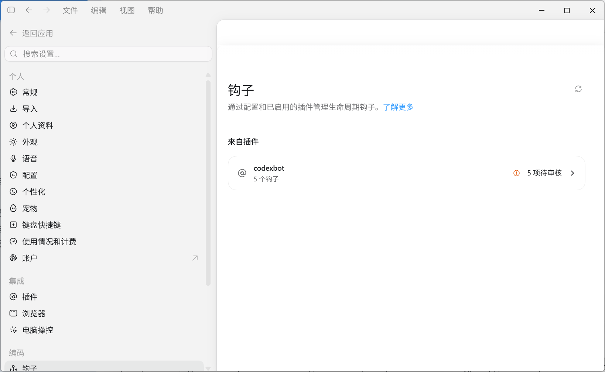
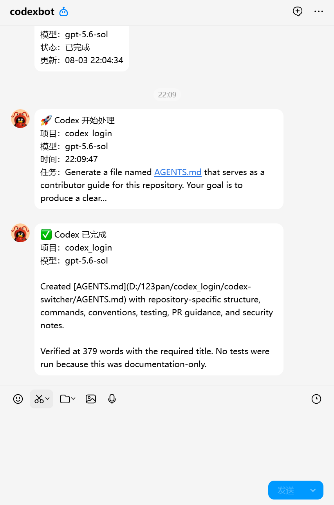

<p align="center">
  
</p>

<h1 align="center">CodexBot</h1>

<p align="center">
  把 Codex 的关键状态带到你的手机上<br>
  Bring the important moments of Codex to your phone
</p>

<p align="center">
  <a href="#中文">简体中文</a> · <a href="#english">English</a>
</p>

<p align="center">
  <a href="https://www.python.org/downloads/release/python-3110/"></a>
  <a href="https://www.microsoft.com/windows"></a>
  <a href="LICENSE"></a>
</p>

## 中文

### 它解决了什么问题？

过去，使用 Codex 写程序意味着你要像监工一样频繁刷新屏幕，紧盯它的每一步操作。

CodexBot 彻底改变了这种体验：它化身为你的“远程助手”，在后台全程托管 Codex 的编程任务，只把那些必须由你拍板的必要事项，精准推送到 QQ 通知你。从此，你不再需要盯屏等待；只要在手机上收到消息时查看提醒，在需要决定时回到 Codex 完成确认，编程过程就能继续推进。

CodexBot 是一个运行在 Windows 本机的 Codex 生命周期通知桥接器。它读取 Codex Hooks，将任务开始、任务完成和可选的权限提醒放入本地队列，再通过 QQ 官方 Bot 沙箱发送给已绑定的 QQ 用户。

> QQ 端是只读通知入口，不能直接批准、拒绝或远程控制 Codex。真正需要确认的操作仍然在 Codex 中完成。

### 核心能力

- 任务开始通知：项目、模型、时间和脱敏后的提示词摘要。
- 任务完成通知：完整的 `last_assistant_message`，超过 QQ 限制时自动分段。
- 权限提醒：默认关闭，显式开启后才通知人工确认请求；自动审查不会默认制造“等待人工审批”的噪音。
- 多窗口支持：多个 Codex 窗口和多个项目共享一个 daemon 与消息队列，会话按 `session_id + 工作目录` 隔离。
- 可靠投递：SQLite WAL、本地 outbox、速率限制、重试、分段和永久错误处理。
- 隐私保护：AppSecret 存放在 Windows Credential Manager；提示词、回复和日志中的常见密钥会脱敏。
- 只读设计：不调用 OpenAI API，不创建第二个 Codex/ChatGPT 会话，也不从 QQ 远程执行命令。

### 环境要求

- Windows 10 或 Windows 11。
- Python 3.11.x。项目要求 `>=3.11,<3.12`，安装器会优先查找 `py -3.11`。
- 已安装并能正常运行的 Codex Desktop 或 Codex CLI，且支持 Codex Plugins / Lifecycle Hooks。
- 一个 QQ 官方机器人沙箱应用，并取得 AppID、AppSecret；需要在 QQ 开放平台启用私聊事件和主动消息能力。
- 你的 QQ 账号已经加入该机器人沙箱。
- 安装依赖和运行通知时需要网络；不需要 OpenAI API Key。

### 安装

在 PowerShell 或命令提示符中执行：

```bat
git clone https://github.com/LeaningLearner/codexbot.git
cd codexbot
.\install.cmd
```

安装器会完成以下工作：

1. 在 `%LOCALAPPDATA%\CodexBot\runtime` 创建隔离的 Python 3.11 环境。
2. 安装锁定版本的依赖和 CodexBot。
3. 将 QQ 凭据写入 Windows Credential Manager。
4. 安装个人 Codex 插件并注册生命周期 Hooks。
5. 生成一次性 QQ 配对码。

安装完成后，重启 Codex，在 Codex 的 `/hooks` 页面检查并信任 `codexbot` Hooks。然后在 QQ 中向机器人发送安装器显示的命令：

```text
/bind XXXX-XXXX
```

配对码默认 30 分钟有效。需要重新生成时执行：

```bat
.\codexbot.cmd pair
```

### 检查安装状态

```bat
.\codexbot.cmd doctor --offline
.\codexbot.cmd doctor
```

`--offline` 会跳过 QQ 网络认证；不带参数时会额外检查 QQ 沙箱 Gateway。

### QQ 命令

| 命令 | 作用 |
| --- | --- |
| `/bind XXXX-XXXX` | 使用一次性配对码绑定 QQ 用户 |
| `/status` | 查看最近的 Codex 项目、模型和状态 |
| `/last [页码]` | 分页读取最近一次完整回复 |
| `/mute` | 暂停未来的主动通知，不补发静音期间的旧消息 |
| `/unmute` | 恢复未来的主动通知 |
| `/help` | 查看帮助 |

### 通知行为

- 提交任务时只保存脱敏后的提示词预览，最多 120 个字符。
- 停止事件会保存完整最终回复，并根据 QQ 消息限制自动分段发送。
- 权限通知默认关闭。如果确实需要人工确认提醒，请在启动 Codex 的终端中设置：

  ```powershell
  $env:CODEXBOT_NOTIFY_PERMISSION_REQUESTS = "1"
  ```

- 权限通知只是提醒，QQ 不能代替 Codex 完成批准或拒绝。

### 多窗口和多项目

多个 Codex 窗口可以同时运行不同项目：

- 默认都使用 `%LOCALAPPDATA%\CodexBot` 下的同一个 SQLite 数据库。
- `daemon.lock` 保证同一数据目录只运行一个 QQ daemon，避免同一机器人建立多个连接。
- 所有项目的事件进入同一个本地 outbox，但会话键包含工作目录，不会因为重复的 `session_id` 覆盖其他项目。
- QQ 绑定、静音状态和 `/last` 的“最近一次回复”是全局设置；通知正文会带项目名。

如果多个项目使用同一 QQ 机器人，请不要为每个项目设置不同的 `CODEXBOT_DATA_DIR`。不同数据目录会绕过共享锁，可能启动多个 daemon。

### 本地数据和安全

运行数据默认位于 `%LOCALAPPDATA%\CodexBot`：

- `state.sqlite3`：会话状态、通知 outbox、配对和最近回复。
- `logs\`：诊断日志，避免记录完整提示词、完整回复和常见密钥。
- `runtime\`：CodexBot 专用 Python 环境。

请不要提交 AppSecret、Access Token、SQLite 数据库或日志。如果凭据曾经出现在公开仓库、截图或日志中，请立即在 QQ 开放平台重新生成。

### 截图





### 开发与验证

```powershell
py -3.11 -m venv .venv
.\.venv\Scripts\python.exe -m pip install -e ".[test]"
.\.venv\Scripts\python.exe -m pytest
.\.venv\Scripts\python.exe "%USERPROFILE%\.codex\skills\.system\plugin-creator\scripts\validate_plugin.py" plugin\codexbot
```

### 相关文档

- [Codex Hooks](https://developers.openai.com/codex/hooks/)
- [Codex Plugins](https://developers.openai.com/plugins/build/plugins)
- [QQ BotPy](https://github.com/tencent-connect/botpy)
- [QQ 消息频控](https://bot.q.qq.com/wiki/develop/api-v2/server-inter/message/overview.html)

## English

### What problem does it solve?

Before CodexBot, using Codex often meant acting like a supervisor: refreshing the screen repeatedly and watching every step of an agentic coding task.

CodexBot turns that into a notification-first workflow. It lets Codex keep working locally in the background and sends only the moments that need your attention to QQ. You no longer need to wait in front of the screen; when your phone receives a notification, you can review it at a glance and return to Codex when a decision is required.

CodexBot is a Windows companion that observes Codex lifecycle hooks, stores events in a local SQLite outbox, and delivers task notifications through the official QQ Bot sandbox to one paired QQ user.

> QQ is a read-only notification channel. It cannot approve, reject, or remotely control Codex. Any real confirmation still happens inside Codex.

### Highlights

- Task-start notifications with the project, model, time, and a redacted prompt preview.
- Complete final replies from `last_assistant_message`, automatically split for QQ limits.
- Optional permission reminders, disabled by default to keep automatic-review noise out of QQ.
- Multiple Codex windows and projects supported by one daemon and one local outbox, with sessions scoped by `session_id + working directory`.
- SQLite WAL, retries, rate limiting, adaptive message splitting, and permanent-error handling.
- AppSecret stored in Windows Credential Manager; common secrets are redacted from previews, errors, and logs.
- Read-only by design: no OpenAI API calls, no second Codex/ChatGPT session, and no remote command execution from QQ.

### Requirements

- Windows 10 or Windows 11.
- Python 3.11.x. The package requires `>=3.11,<3.12`.
- A working Codex Desktop or Codex CLI installation with Codex Plugins / Lifecycle Hooks support.
- An official QQ Bot sandbox application with an AppID and AppSecret, with private-message events and proactive messaging enabled.
- Your QQ account added to the bot sandbox.
- Network access for installation and QQ delivery. An OpenAI API key is not required.

### Installation

Run this from PowerShell or Command Prompt:

```bat
git clone https://github.com/LeaningLearner/codexbot.git
cd codexbot
.\install.cmd
```

The installer creates an isolated Python runtime, installs pinned dependencies, stores QQ credentials in Windows Credential Manager, installs the personal Codex plugin, and generates a one-time pairing code.

Restart Codex, open `/hooks`, and trust the `codexbot` lifecycle hooks. Then send the pairing command shown by the installer to the QQ bot:

```text
/bind XXXX-XXXX
```

Regenerate a pairing code with:

```bat
.\codexbot.cmd pair
```

### Commands

| Command | Purpose |
| --- | --- |
| `/bind XXXX-XXXX` | Bind the QQ user with a one-time pairing code |
| `/status` | Show recent Codex projects, models, and states |
| `/last [page]` | Read the most recent complete reply page by page |
| `/mute` | Pause future proactive notifications without backfilling old ones |
| `/unmute` | Resume future proactive notifications |
| `/help` | Show the command help |

To opt into manual permission reminders, set this before launching Codex:

```powershell
$env:CODEXBOT_NOTIFY_PERMISSION_REQUESTS = "1"
```

Permission reminders are informational only; QQ cannot approve the operation for you.

### Multiple windows and projects

Multiple Codex windows can run different projects at the same time. The default shared data directory is `%LOCALAPPDATA%\CodexBot`; `daemon.lock` keeps one QQ daemon per data directory, and the outbox stores events from all projects while scoping sessions by their working directory.

Binding, mute state, and `/last` are global to the paired bot. If multiple projects use the same QQ bot, keep the default shared `CODEXBOT_DATA_DIR`; separate data directories can start separate daemons and cause duplicate QQ connections.

### Privacy and local data

Runtime data is stored under `%LOCALAPPDATA%\CodexBot`. Credentials stay in Windows Credential Manager. Prompt previews, errors, and logs are redacted where possible. Do not commit credentials, access tokens, SQLite state, or logs.

### Development

```powershell
py -3.11 -m venv .venv
.\.venv\Scripts\python.exe -m pip install -e ".[test]"
.\.venv\Scripts\python.exe -m pytest
.\.venv\Scripts\python.exe "%USERPROFILE%\.codex\skills\.system\plugin-creator\scripts\validate_plugin.py" plugin\codexbot
```

## License

CodexBot is released under the [MIT License](LICENSE).
