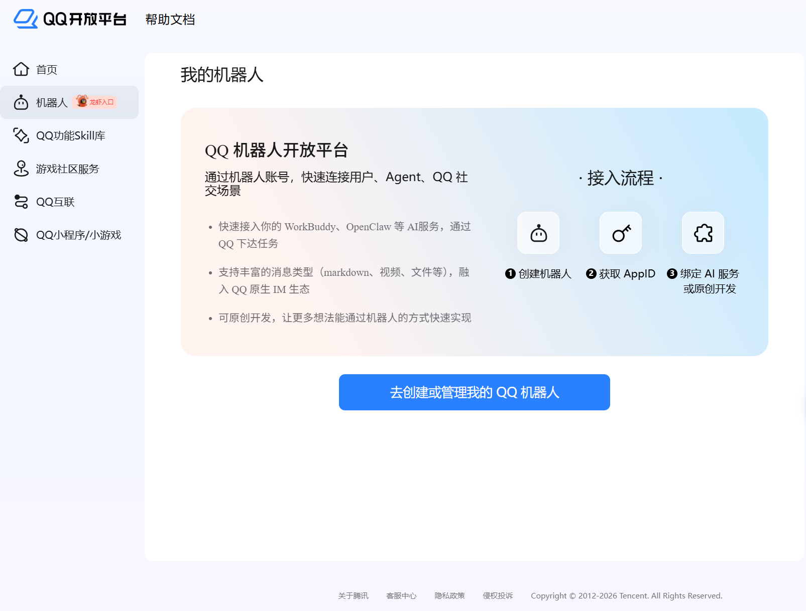
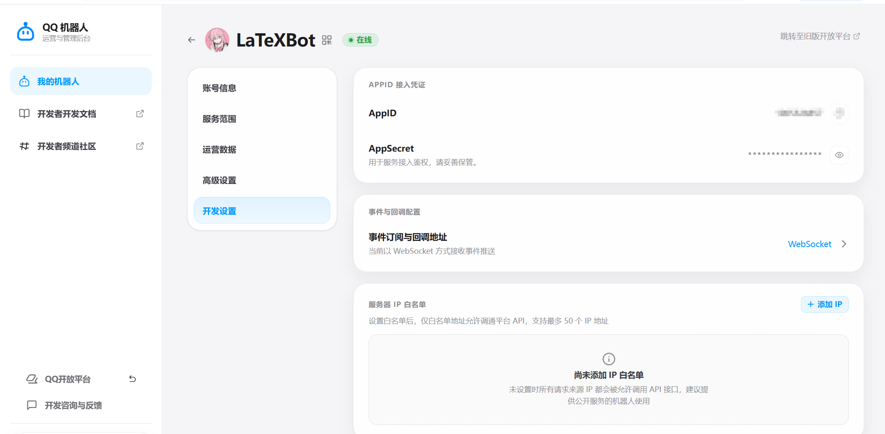

# CodexBot

CodexBot 把当前 Windows Codex 应用的任务状态通过 QQ 官方机器人沙箱发送到你的手机。它读取 Codex 生命周期 Hook，不调用 OpenAI API，不创建第二个 Codex/ChatGPT 会话，也不能从 QQ 远程批准或控制 Codex。

## 使用截图

安装插件后，在 Codex 的 `/hooks` 页面中确认 `codexbot` 的五个生命周期 Hook 已被信任：


任务开始、完成或需要权限时，QQ 沙箱会收到对应的状态通知：


截图只用于展示流程；公开仓库不包含 QQ AppID、AppSecret、Access Token 或本机运行数据。

## QQ 控制台配置参考

QQ 开放平台的页面名称可能随版本更新而变化，下面按当前常见路径说明配置方法。

1. 打开 [QQ 开放平台](https://q.qq.com/)，进入“机器人”页面，选择“去创建或管理我的 QQ 机器人”。

   

2. 创建机器人应用，并在机器人详情的“开发设置”中查看 AppID 接入凭证。AppID 可以写入本地受保护配置，AppSecret 只能写入 Windows Credential Manager 或其他受保护的环境变量。

   

3. 在“事件与回调配置”中按控制台提供的方式启用事件接收；本项目使用 QQ 官方 BotPy 沙箱能力，并通过一次性配对码限制可读取通知的 QQ 用户。

不要把真实 AppSecret、配对码、Access Token、QQ 号或 SQLite 数据库提交到 Git；如果凭据曾经出现在截图、日志或公开仓库中，应立即在 QQ 开放平台重新生成。

## 安装

前置条件：

- Windows 10/11 与 Python 3.11。
- 已创建 QQ 官方机器人并取得 AppID/AppSecret。
- 自己的 QQ 已加入该机器人的沙箱，且允许机器人主动发送消息。

在此目录打开终端并运行：

```bat
.\install.cmd
```

安装器会优先使用 `py -3.11`，在 `%LOCALAPPDATA%\CodexBot\runtime` 创建隔离环境并按 `requirements.lock` 安装固定版本；随后将 AppID/AppSecret 存入 Windows Credential Manager，把插件复制到 `~/plugins/codexbot`，合并个人 `~/.agents/plugins/marketplace.json`，并通过 `codex plugin add` 安装插件。更新时再次运行同一命令即可；已有 marketplace 内容不会被覆盖，修改前会生成 `.codexbot.bak` 备份。

需要更换 QQ AppID/AppSecret 时运行：

```bat
.\install.cmd --replace-credentials
```

随后：

1. 重启 Codex。
2. 在 Codex 中打开 `/hooks`，检查并信任 `codexbot` 的五个 Hook。
3. 打开任意 Codex 任务，使伴随进程启动。
4. 用沙箱 QQ 私聊发送安装器显示的 `/bind XXXX-XXXX`。

配对码过期后，在此目录运行：

```bat
.\codexbot.cmd pair
```

## QQ 命令

- `/status`：查看最近活动任务、模型和状态。
- `/last [页码]`：分页读取最近一次完整最终回复。
- `/mute`：暂停未来主动通知；静音期间不补发旧通知。
- `/unmute`：恢复未来通知。
- `/help`：显示命令帮助。

只有一次性配对码绑定的 `user_openid` 能使用这些命令。其他用户的消息会被忽略。

## 通知行为

- 提交任务：项目、模型、时间和脱敏后的提示词前 120 字。
- 请求权限：工具和简短原因，提醒返回 Codex 本机审批；机器人不会批准或拒绝。
- 任务停止：Codex `last_assistant_message` 的完整文本，按 QQ 限制自动分段。
- 不发送隐藏推理、工具日志、子代理输出、图片或附件。

主动消息按每分钟 18 条节流，低于 QQ 官方单关系 20 qpm 的限制。网络错误会重试；QQ 拒收、关闭主动消息、内容违规等永久错误不会循环发送，最近回复仍可用 `/last` 被动读取。

## 生命周期与数据

伴随进程不是 Windows 服务，也不开机启动。它在第一个 `SessionStart` 或 `UserPromptSubmit` Hook 到来时隐藏启动，监视实际 Codex 桌面宿主 PID 与创建时间；Codex 宿主退出并连续两次确认后，伴随进程约 2 秒内退出。

本地数据位于 `%LOCALAPPDATA%\CodexBot`：

- `state.sqlite3`：事务队列、单用户绑定、最近回复和任务状态。
- `logs/`：轮转诊断日志，不记录 AppSecret、完整提示词或完整最终回复。
- `runtime/`：隔离 Python 环境。

诊断命令：

```bat
.\codexbot.cmd doctor
.\codexbot.cmd doctor --offline
```

默认 `doctor` 会使用已保存凭据请求 QQ 沙箱的机器人信息，但不会发送业务消息；`--offline` 跳过网络检查。Hook 信任状态必须在 Codex `/hooks` 中人工确认。

## 开发验证

```bat
py -3.11 -m venv .venv
.\.venv\Scripts\python.exe -m pip install -e ".[test]"
.\.venv\Scripts\python.exe -m pytest
.\.venv\Scripts\python.exe "%USERPROFILE%\.codex\skills\.system\plugin-creator\scripts\validate_plugin.py" plugin\codexbot
```

## 参考

- [Codex Hooks](https://developers.openai.com/codex/hooks/)
- [Codex 插件](https://developers.openai.com/plugins/build/plugins)
- [腾讯 BotPy](https://github.com/tencent-connect/botpy)
- [QQ 消息频控](https://bot.q.qq.com/wiki/develop/api-v2/server-inter/message/overview.html)
- [QQ 单聊发送接口与错误码](https://bot.q.qq.com/wiki/develop/api-v2/autogen/api/v2_users_user_openid_messages.post.html)
